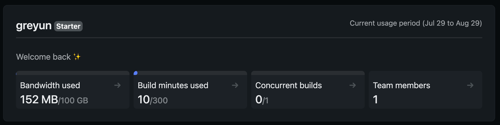

## 들어가며...

많은 개발자들은 새롭게 배운 내용을 잊지 않기 위해서나 겪었던 이슈를 미래에 다시 참고하기 위해 혹은 다른 개발자와 공유하기 위해 여러가지 경험들을 기록으로 남기고 싶어 한다.

일부 개발자들은 더 나아가 자신이 직접 만든, 자신의 도메인으로 서비스 되는 그런 블로그를 갖기를 갈망한다. 그게 바로 나다.😁

네이버와 티스토리 블로그를 사용했었지만 항상 플랫폼을 벗어나 나만의 블로그를 가지고 싶은 소망을 품고있었다.(기존 블로그에 쓰던 글들이 너무 저퀄이여서 도피하는 것 절대 아님)

## 블로그 개발 전 고려했던 사항들

> 블로그 직접 만들기 어렵지 않나요?

나도 그렇게 생각했다. 현재 운영되고 있는 블로그 플랫폼에는 실제로 많은 기능들이 구현되어 있다. 이 기능들을 모두 구현하지는 않겠지만 직접 블로그를 구축하기로 결심했을 때 아래 필수적인 고려사항들이 떠올랐다.

### 1. 화면 개발

블로그를 개발하는데 가장 중요한 부분이지 않을까 싶다. 내가 front-end 개발자가 아니기 때문에 화면을 백지부터 개발할 수는 없었다. 그래서 기본적인 레이아웃이나 테마를 통해 블로그 형태를 잡아줄 무언가가 필요했다.

### 2. 게시글 관리

처음 블로그 개설을 고려했을 때, 네이버와 티스토리 같은 블로그 플랫폼들의 CMS(Contents Management System) 기능을 직접 구현해야 하나 고민했다. 게시글 CRUD, 글쓰기 페이지 내 TextArea 와 엮이는 무수히 많은 기능들을 다 만든다고?

### 3. 자동배포 이거 한 번 해보고 싶은데요

아직 해보지 못한 것 중에 가장 해보고 싶었던 것이 git 과 연동하여 자동 배포 환경을 구성하는 것이다. git actions, aws CodeDeploy 등을 알아봤지만 단기간에 활용할 수 있는 간단한 것들은 아니라고 판단되었다.

## 그래서 어떻게 만들었나?

gatsby 를 통해 1번과 2번을 해결했고 netlify 로 3번을 해결할 수 있었다.

### gatsby

gatsby 는 react 기반 정적 사이트 생성기이다. build 시 세팅한 설정과 react 로 작성된 js, 그리고 md 파일(이 프로젝트의 경우는)들에 기반하여 정적 HTML 파일들을 생성한다. 이 때문에 was 없이 web server 에서 바로 serving 되기 때문에 컨텐츠 로드 속도 또한 빠르다.

gatsby 는 여러 cms 서비스들과도 연동할 수 있는데 보통 블로그 작성 시에는 사용하기 편한 markdown 을 활용하는 듯 하다. md 파일을 통한 게시글 관리가 추후 재사용하기에도 좋고 md format 연습에도 도움이 될 것 같다.

또한 gatsby 는 [gatsby-starters](https://www.gatsbyjs.com/starters/)라는 일종의 테마 프로젝트들을 소개하고 있다. 이 덕분에 화면을 백지부터 개발해야하는 수고를 덜 수 있었다.

### netlify

뭐라고 불러야 할 지 애매하지만... 호스팅 및 빌드, 배포 해주는 플랫폼 이라고 적을 수 있겠다.

netlify 는 기본적으로 호스팅을 제공하며 github 과 연동하면 해당 repository 특정 branch 에 pull request 시 CI, merge 시 배포까지 해준다. 무려 공짜로!

## 블로그 개설

블로그를 개설하는 구체적인 방법과 해당 블로그의 특징은 [gatsby-starter-hoodie](https://github.com/devHudi/gatsby-starter-hoodie/blob/develop/README-kr.md)에 자세히 나와있어 이를 참고해 진행했다.

위 starter 개발자분께서 가이드를 자세히 적어두셨기에 내가 했던 것들을 간략히만 적었다.

1. git repository 생성 및 gatsby-starter-hoodie copy & paste
2. blog-config.js 와 static image 들을 내 것으로 교체하여 push
3. netlify 계정 생성 및 github 연동
4. 개인 domain 을 사용할 것이기에 netlify-도메인 연동 작업 진행
5. main branch 에 pull request merge 하여 자동배포 확인

## 결론: 쉽고 빠르게 사용성 좋은 개인 블로그를 얻었다

gatsby starter 와 netlify 를 활용한다면 빠르게는 10분 안에도 개인 블로그 개설이 가능할 것 같다. 여러 블로그 플랫폼을 벗어나 자신만의 블로그를 가지고 싶어하는 사람들에게 좋은 선택지가 될 수 있다 생각한다.

### 아직 한 발 남았다

추후에는 화면까지 내가 직접 만든 블로그로 이전할 것이다. md file 로 게시글들을 관리할 수 있으니 블로그 이전 시 큰 문제가 없으리라 감히 단정지으면서...(제발)
